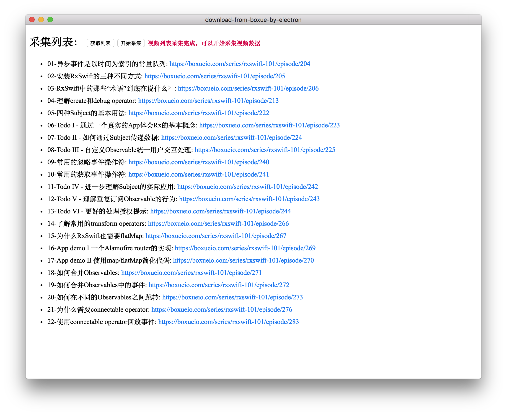

download-from-boxue-by-electron
---
泊学网的视频很不错，4k高清，讲师讲解的也不错，但是发现一个个下载实在太麻烦，就索性写个批量下载  
泊学网视频是会员订阅制，所以没有订阅的话，是下载不了的  
既然是订阅制，就涉及到session授权的一些东东，懒得麻烦去搞这个，索性用了``electron``  
``electron``的壳本质还是浏览器，登录之后session自动继承，就免去了这部分的逻辑  
  
打开之后会有一个主视窗，用来操作采集操作  
会有一个副窗口，主要用于浏览自己需要的视频列表进行采集，当然登录操作也是在这里进行的

1.副窗口打开目标视频列表之后就可以点``获取列表``按钮了  
2.列表采集完成之后会在主窗口内显示，这时就可以点击``开始采集``  
3.所有视频信息采集完成之后视频下载信息会写入到``dest/list.txt``文件内  
4.这个时候执行``npm run download``视频就会自动下载到``dest``目录下  
5.等待下载完成之后再转移到其他目录就可以了  
  
时间比较赶，就写的比较糙，先凑活用着，后面有时间再改进  
  
PS. 泊学网视频是订阅制，非订阅付费视频是不能下载的，泊学内容还是很不错的，有需要的同学推荐订阅

#### Start
```sh
npm start
```

#### Download
```sh
# 视频信息采集完成之后执行
npm run download
```

